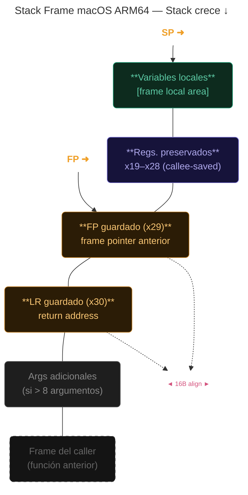

- =====================================

Autor: Estrada Rodriguez Melani

Materia: Lenguajes de Interfaz 

Grupo: SC6C

Fecha: 26/ Marzo /2026

Descripción: Practicas de Microbit. 

- =====================================

# MicrobitEVALpython 🧩
Antes de empezar a mostrar las practicas realizadas, se necesita saber que Micro bit es una pequeña tarjeta programable para crear diferentes usos con ella, por su amplio uso.

Este contiene sensores, luces LED, botones, radio, entre otras cosas. Al ser fácil de programar lo hace ideal para principiantes y personas que quieren empezar a aprender.


## 1. Practica para agarrar confianza ⚙️
En la primera practica, se hizo el código que viene por defecto y se empezó a buscar entre los códigos de referencia para aprender más, en los primeros códigos se busco practicar con las diferentes melodías y códigos que se me iba encontrando.
> Muestra un corazón y un saludo para después poner la canción de NYAN.


https://github.com/user-attachments/assets/04823373-e444-4155-af28-5a49710f83ad


*Código realizado:*
```codigo
# Imports go at the top
from microbit import *
import music

# Code in a 'while True:' loop repeats forever
while True:
     display.show(Image.HEART)
     sleep(1000)
     display.scroll('Hola')
     music.play(music.NYAN)
```

## 2. Uso de Sensores en Microbit 🧸
La segunda practica se necesito la utilización de los sensores, para realizarla se utilizo [makecode.microbit](https://makecode.microbit.org/#) para buscar ideas y se realizo la del hámster mascota, esta mascota si la agitas se pone triste y si tocas la carita se pone feliz.

> Video de como se veía el hámster mascota y sus interacciones.

https://github.com/user-attachments/assets/54442048-fb37-4876-9ef2-960338921d27

*Código realizado:*

```micro:bit
# Imports go at the top
from microbit import *


# Code in a 'while True:' loop repeats forever
import music

while True:
    if pin_logo.is_touched():
        display.show(Image.HAPPY)
        music.play(music.JUMP_UP)
        display.show(Image.ASLEEP)
    
    if accelerometer.was_gesture('shake'):
        display.show(Image.SAD)
        music.play(music.WAWAWAWAA)
        display.show(Image.ASLEEP)
    
    sleep(100)
```


## 3. Uso de Radio 900 MHz 👾
En esta practica no hubo muchos problemas, con los códigos de ejemplo de la plataforma donde se realizo, en este caso [python.microbit](https://python.microbit.org/v/3/reference) solo que en la parte "Grupo" de la radio se cambio de 23 a 20, para que el trabajo de los demás compañeros no interfiriera en la señal.

> Por medio de la radio se envía la señal al receptor, mensaje: "Hola", en el video se muestra la llegada del mensaje.

https://github.com/user-attachments/assets/df108c69-5777-483a-b5ad-5d3c1cde4eb8

*Código realizado (Receptor):*
```micro:bit
from microbit import *
import radio

radio.config(group=20, power = 5)

radio.on()

while True:
    message = radio.receive()
    if message:
        display.scroll(message)
```

*Código realizado (Emisor):*
```micro:bit
# Imports go at the top
from microbit import *
import radio


# Code in a 'while True:' loop repeats forever
radio.config(group=20, power=5)
radio.on()
while True:
    if button_a.was_pressed() or button_b.was_pressed():
        radio.send('Hola')
```
---
### Aprendido 👾

Con lo anterior visto se aprendió bastante del lenguaje Python y como se puede utilizar en un micro bit, estas practicas fueron muy entretenidas y enriquecedoras. 

las practicas iban aumentando el nivel con el pasar de los días y se podían lograr diferentes resultados con los códigos, si necesitaba inspiración solo debía ir al apartado de ideas o en makecode.microbit, la practica que mas me gusto fue la del hámster mascota, pero las demás igualmente fueron entretenidas.

---

## Sobre el compilador en macOS con chips Apple M (Apple Silicon)


En las MacBook con procesador Apple M (M1, M2, M3, etc.) el compilador que se usa normalmente es "Clang", que viene con las herramientas de Xcode.

Aunque el procesador es de tipo ARM (igual que algunos celulares o Raspberry Pi), en la práctica no todo funciona igual que en Linux. Hay pequeñas diferencias importantes cuando se programa a bajo nivel.

en ensamblador por ejemplo:

-   La forma de hacer llamadas al sistema es diferente.
-   Se usan otros números y registros.
-   El programa se compila de forma distinta.

Un ejemplo de esto lo vi en el código que muestra un “Hola mundo” en ensamblador para Mac con chip M:  [gist.github.com/IoTeacher](https://gist.github.com/IoTeacher/2794445dda77f272a6b5ce6a665ac9bd)

Para compilar en una Mac normalmente se usa un comando como: Bash

---

# ARM64 (AARCH64) 🛰️

## Linux vs Darwin ABI
Ambos sistemas usan la misma arquitectura ARMv8-A, pero difieren en cómo el kernel expone servicios al espacio de usuario.

*Linux ARM64 ABI (AAPCS64)*

Usa GNU/GAS assembler, llamadas al sistema directas con  `svc #0`, número de syscall en  `x8`.

*Darwin / macOS ABI (Apple ABI)*

Usa LLVM/Clang assembler, llamadas al sistema con  `svc #0x80`, número de syscall en  `x16`.

**Cuadro Comparativo**
Aspecto | Linux ARM64 | Darwin / macOS
|--|--|--|
Syscall nº | `x8` |`x16`
Instrucción |`svc #0`|`svc #0x80`
Entry point |`_start`|`_main`
Assembler | GNU GAS (`as`) |LLVM Clang (`as`)
Linker |`ld`  (GNU) |`ld`  (Apple) +  `-lSystem`
Formato obj. | ELF64 | Mach-O 64-bit
Secciones |`.text`  /  `.data`  /  `.bss`|`__TEXT,__text`  /  `__DATA,__data`
Alineación |`.align N`  (bytes) |`.align N`  (potencia de 2)
Debugger |`gdb`|`lldb`
exit syscall |`#93`  (exit_group) |`#1`  (exit)
write syscall |`#64`|`#4`

---

## Stack Frame en macOS ARM64
La convención ABI de Apple exige que el stack esté alineado a 16 bytes en cualquier llamada a función.



**Prólogo / Epílogo típico**
```code
_myFunction:
 ; ── PRÓLOGO ──────────────────
 stp  x29, x30, [sp, #-16]!
 mov  x29, sp
 sub  sp, sp, #32

 ; ── CUERPO ───────────────────
 str  x19, [sp]
    ...

 ; ── EPÍLOGO ──────────────────
 ldr  x19, [sp]
 ldp  x29, x30, [sp], #16
 ret
```

**Reglas críticas macOS**
* El SP debe estar alineado a: 16 bytes, siempre que se hace`bl`.
* `stp x29, x30`debe ser la primera instrucción del prólogo.
* `x29`(FP) debe apuntar al par FP/LR del frame actual.
* Apple LLDB usa el FP para unwind, sin él, los stack traces fallan.
* El SP nunca debe quedar en valor no múltiplo de 16.

---

## Stack Frame en macOS ARM64
Define cómo se pasan argumentos, qué registros preservar y cómo se retornan valores entre funciones.

**Uso de Registros:**

| Registro     | Alias      | Uso                                      | Preserva   |
|--------------|------------|------------------------------------------|------------|
| **x0-x7**    | a0-a7      | Args / retorno                           | **Caller** |
| **x8**       | xr         | Indirect result (Linux: syscall)         | **Caller** |
| **x9-x15**   | —          | Temporales (scratch)                     | **Caller** |
| **x16**      | ip0/ip1    | Scratch (Apple: syscall n°1)             | **Caller** |
| **x17**      | —          | Reservado en macOS                       | —          |
| **x18**      | —          | Callee-saved                             | **Callee** |
| **x19-x28**  | —          | Callee-saved                             | **Callee** |
| **x29**      | fp         | Frame pointer                            | **Callee** |
| **x30**      | lr         | Link register                            | **Callee** |
| **sp**       | —          | Stack pointer (16B-aligned)              | **Callee** |
| **xzr**      | —          | Zero register                            | —          |

*Ejemplo: llamada con 3 argumentos*
```code
; result = add3(10, 20, 30)
mov   x0, #10      ; arg1
mov   x1, #20      ; arg2
mov   x2, #30      ; arg3
bl    _add3
; resultado en x0

_add3:
    stp   x29, x30, [sp, #-16]!
    mov   x29, sp
    add   x0, x0, x1
    add   x0, x0, x2
    ldp   x29, x30, [sp], #16
    ret
```
>En Linux el FP es _opcional_. En macOS es _obligatorio_ para el debugger y `libunwind`.

---

## Mach-O vs ELF
Dos formatos binarios para el mismo hardware ARM64. Mach-O es el formato nativo de Apple; ELF es el estándar en Linux.

*Mach-O (macOS / iOS)*
*   Mach-O Header | magic, cputype, filetype
* Load Commands | LC_SEGMENT_64, LC_SYMTAB…
* __TEXT segment | __text, __stubs, __cstring
* __DATA segment | __data, __bss, __got
* __LINKEDIT | Símbolos, relocs, strings


*ELF (Linux ARM64)*
* ELF Header | magic, e_type, e_machine
* Program Headers | PT_LOAD, PT_DYNAMIC
* .text section | Código ejecutable
* .data / .bss | Datos init. / sin init.
* Section Headers | Tabla de secciones + strings

Mach-O específico | ELF específico
|--|--|
Fat Binary (lipo): múltiples arqs en un archivo | Program headers definen segmentos de carga
Load Commands describen el layout de memoria |ld-linux.so como dynamic linker estándar
dyld (dynamic linker) propio de Apple | Formato universal en Linux / BSD / Android
Código firmado (codesign) obligatorio en HW real | No requiere firma de código

*Comandos útiles*
```code
# macOS — inspeccionar Mach-O
otool   -h binary           # Mach-O header
otool   -l binary           # Load commands
nm      -arch arm64 binary  # Tabla de símbolos
lipo    -info binary        # Arquitecturas en Fat Binary
objdump --macho -d binary   # Disassembly Mach-O

# Linux — inspeccionar ELF
readelf -h binary           # ELF header
readelf -l binary           # Program headers
objdump -d binary           # Disassembly ELF
nm      binary              # Tabla de símbolos
```

---

## Conversión: Linux ARM64 → Apple Silicon
Programa "Hola Mundo" convertido de GNU/Linux ARM64 a macOS Apple Silicon. Las líneas resaltadas indican los cambios.

*Linux ARM64 (GNU GAS)*
```code
.data
msg:  .ascii "Hola Mundo\n"
len = . - msg

.text
.global _start

_start:
    ; write(1, msg, len)
 mov  x8,  #64   ; syscall write
    mov  x0,  #1    ; stdout
    adr  x1, msg    ; dirección msg
    mov  x2,  #11   ; longitud
 svc #0           ; ← Linux

    ; exit(0)
 mov  x8,  #93   ; exit_group
    mov  x0,  #0
 svc #0
```

*Apple Silicon (LLVM/Clang)*
```code
.section __DATA,__data
msg:  .ascii "Hola Mundo\n"

.section __TEXT,__text
.global _main
.align  2

_main:
    ; write(1, msg, 11)
 mov  x16, #4    ; syscall write
    mov  x0,  #1    ; stdout
    adr  x1, msg    ; dirección msg
    mov  x2,  #11   ; longitud
 svc #0x80        ; ← macOS

    ; exit(0)
 mov  x16, #1    ; exit
    mov  x0,  #0
 svc #0x80
 ```

**Checklist de conversión**
1. Entry point `_start`  →  `_main`
2. Registro syscall `x8`  →  `x16`
3. Instrucción syscall `svc #0`  →  `svc #0x80`
4. Número de syscall, write:  `#64`→`#4`  / exit:  `#93`→`#1`
5. Secciones `.text/.data`  →  `__TEXT,__text`
6. Alineación, Agregar  `.align 2`  antes de  `_main`

*Compilar y ejecutar en macOS*
```code
# Ensamblar
as -arch arm64 -o hello.o hello.s

# Enlazar (requiere Xcode SDK)
ld -o hello hello.o \
   -lSystem \
   -syslibroot `xcrun -sdk macosx --show-sdk-path` \
   -e _main \
   -arch arm64

# Ejecutar
./hello
# Hola Mundo

# Verificar formato Mach-O
file  hello        # Mach-O 64-bit executable arm64
otool -hv hello    # Mach-O header
```
>  Estas son las únicas diferencias entre un programa ARM64 de Linux y uno de Apple Silicon. La ISA (juego de instrucciones) es idéntica — solo cambia la interfaz con el SO (ABI) y el formato del binario.

```
clang programa.s -o programa
```

Aunque también es necesario instalar las "Command Line Tools" de Xcode para poder compilar programas desde la terminal.

Por lo cual, aunque la Mac es muy rápida y moderna, cuando uno quiere programar cerca del hardware hay que tomar en cuenta que macOS funciona un poco diferente a Linux, incluso aunque este usando el mismo tipo de procesador.
